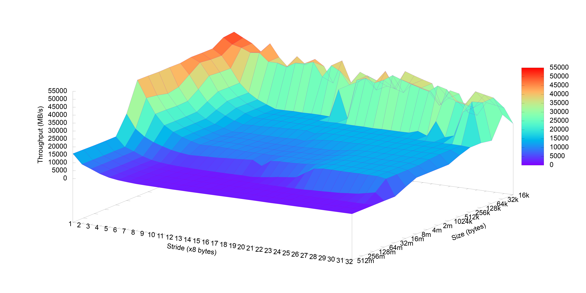

# Assignment 1

Here is just a quick summary of the commands run to complete Assigment 1. We will write more detailed in the pdf.

## Task 1.1

We have a C program given to us. Step one is to move the code to Dardel. This can be done using `scp` or just copy-paste. `PrgEnv-cray` is loaded upon login, so to compile the program we simply have to run `cc main.c`. Now we have a compiled binary `a.out`. 

To run the executable in interactive mode, we first run:
```
salloc -N 1 -t 0:02:00 -A edu25.dd2356 -p main
```
Once we have been granted the interactive session, we run the following:
```
srun -n 128 ./a.out
```

To instead submit a batch job, we enter the following into `jobscript.sh`:
```
#!/bin/bash
#SBATCH -A edu25.dd2356
#SBATCH -J mpiHelloWorld
#SBATCH -t 0:02:00
#SBATCH -p main
#SBATCH -N 1
srun -n 128 ./a.out
```

## Task 2

We plug in all the values into the [calculator](https://calculator.green-algorithms.org). The calculator does not have the exact CPU (AMD EPYC 7742 as given by `lscpu`), so we instead use AMD EPYC 7763. Since we are using 10 nodes we set the amount of memory to 256 GB x 10 = 2560 GB.

The calculator gives us a Carbon footprint of 699.01 gCO2e and 123.28 kWh Energy needed.

## Task 3

We run memory mountain on Dardel, making sure to change MAXBYTES to `1 << 29`. Plotting the results using gnuplot we get the following result:



